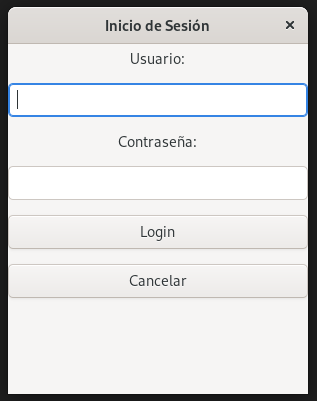
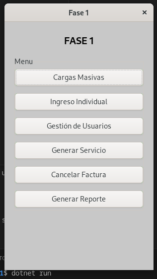
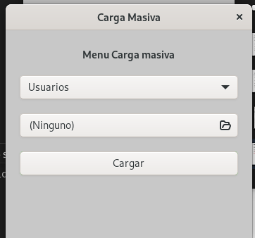
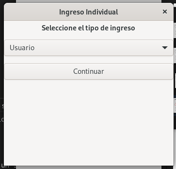
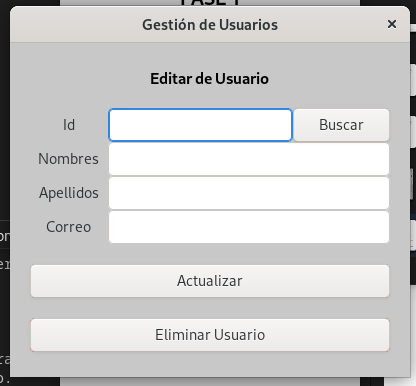
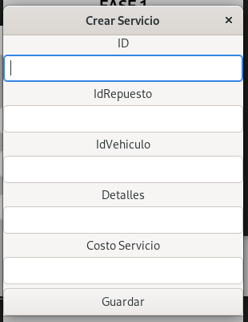
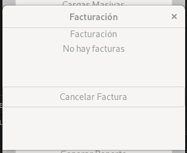

# MANUAL DE USUARIO

Al iniciar el programa le aparecerá la pantalla donde tendrá que **loguearse**.

El usuario **root** deberá iniciar con:
Usuario: root@gmail.com
Contraseña: root123

Al **loguearse** aparecerá la siguiente interfaz.

Aparecerá el **menú** en pantalla con las siguientes opciones:

* **Carga Masiva:** Aquí cargará los datos de usuarios, vehículos y repuestos de forma masiva mediante un archivo **.JSON**.

    

* **Ingreso individual:** Podrá ingresar los usuarios, vehículos y repuestos de forma individual.

    

* **Gestión de Usuarios:** Aquí podrá ver los usuarios, así como actualizarlos y eliminarlos.

    

* **Generar Servicio:** Aquí podrá generar un servicio mediante el Id del usuario, del vehículo y del repuesto.

    

* **Cancelar Factura:** Aquí aparecerán las facturas generadas por cada servicio generado, una vez cancelada la factura no volverá a aparecer.

    

* **Generar reporte:** Esto genera imágenes **png** mediante **graphviz**, reportes de usuarios, repuestos, vehículos, servicios y facturas.
